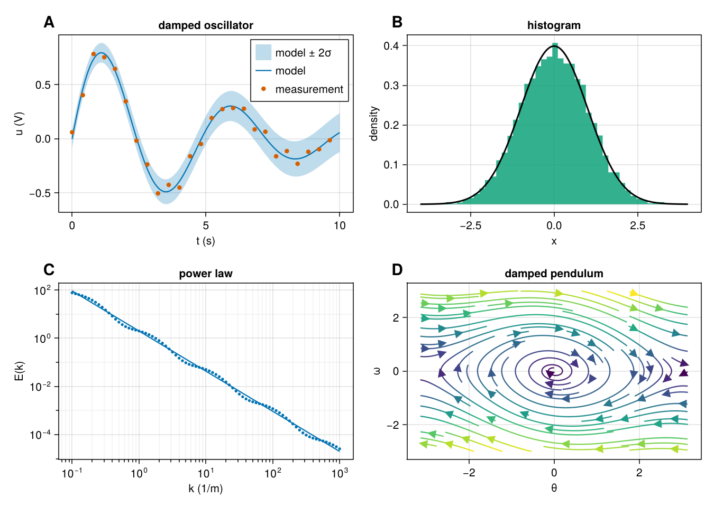
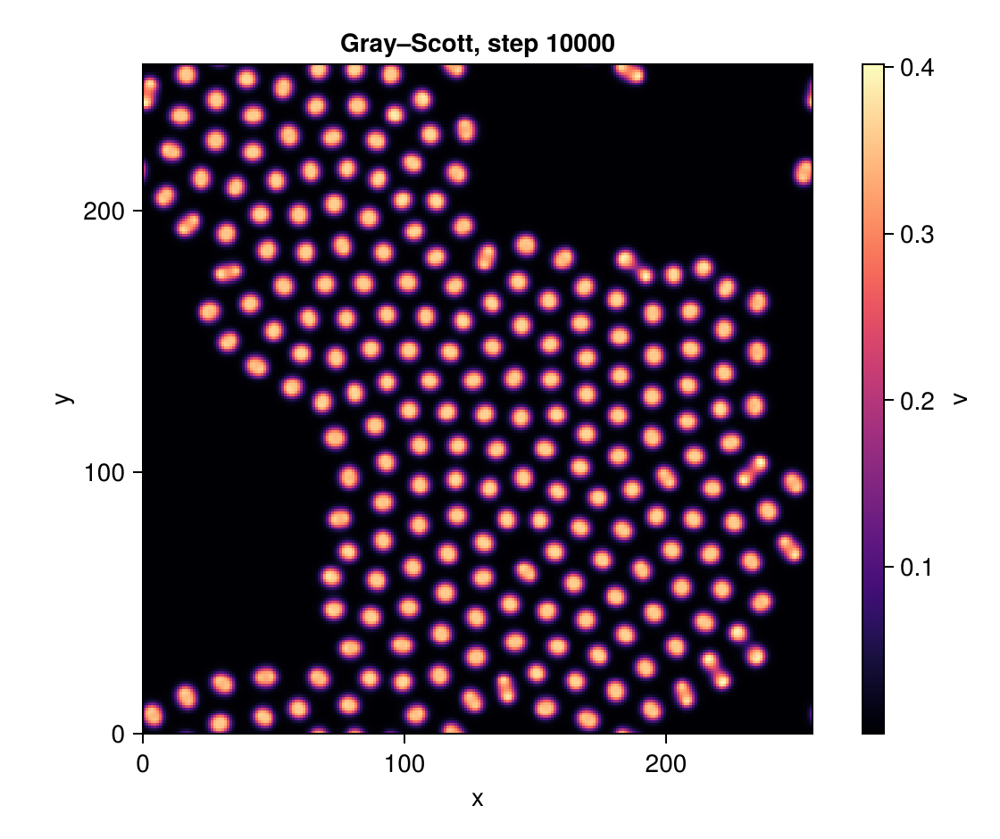
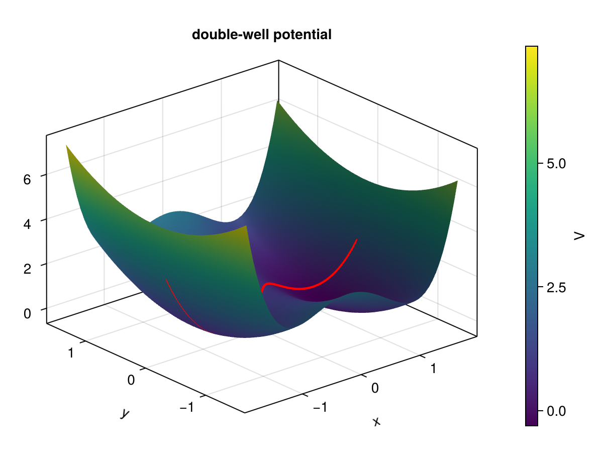

# sciplot

sciplot brings Makie's design (Figure / Axis / GridLayout, its defaults and its look) to Rust:
native GPU windows with live updates, PNG and SVG export, and the browser (WebGPU, with a WebGL2
fallback). It is aimed at publication figures and at visualizing dynamic systems while they run.

**Status: pre-release.** The API may still change, and the crate is not on crates.io yet, so
depend on it through git or a local path. So far it is developed and tested on macOS (Apple
silicon, Metal).

sciplot was built with extensive AI assistance. It's useful to me; perhaps it will be to you.



## Installation

```toml
[dependencies]
sciplot = { git = "<repository URL>" }       # or: sciplot = { path = "../sciplot" }

# Recommended: optimize sciplot in debug builds too. Unoptimized, it takes ~10x longer to build
# each frame, and live windows stutter.
[profile.dev.package.sciplot]
opt-level = 2
```

`[profile.dev.package."*"]` with `opt-level = 2` does the same for every dependency (wgpu
included). sciplot needs Rust 1.88 or newer.

Cargo features:
- `window` (default): interactive windows (winit).
- `cpu-png` (default): the CPU rasterizer (resvg). It is used for PNG export when no GPU adapter
  is available.
- `ndarray`: `ndarray` arrays as plot input.

Without default features you get headless PNG export on the GPU plus SVG export.

## Quick start

A one-liner creates a figure with an axis and a plot:

```rust no_run
use sciplot::prelude::*;

fn main() -> sciplot::Result<()> {
    let x = linspace(0.0, 10.0, 200);
    scatter(&x, x.iter().map(|t| t.sin())).save("scatter.png")?; // 600 × 450 units -> 1200 × 900 px
    Ok(())
}
```

For more control, build the figure explicitly. The keyword macros (`Axis!`, `lines!`, ...)
expand to builder calls, so `Axis!(fig.at(1, 1); title = "a")` is `Axis::new(fig.at(1, 1)).title("a")`.
A misspelled keyword is an ordinary "no method named ..." compile error.

```rust no_run
use sciplot::prelude::*;

fn main() -> sciplot::Result<()> {
    let t = linspace(0.0, 10.0, 300);
    let td: Vec<f64> = t.iter().step_by(15).copied().collect();

    let fig = Figure!(size = (800, 350));
    let a = Axis!(fig.at(1, 1); title = "ω = 1", xlabel = "t (s)", ylabel = "u (V)");
    let b = Axis!(fig.at(1, 2); title = "ω = 2", xlabel = "t (s)");
    for (ax, w) in [(&a, 1.0), (&b, 2.0)] {
        lines!(ax, &t, t.iter().map(|t| (w * t).sin() * (-0.1 * t).exp()); label = "model");
        scatter!(ax, &td, td.iter().map(|t| (w * t).sin() * (-0.1 * t).exp()); label = "data", color = WONG[1]);
    }
    linkyaxes(&[&a, &b]);
    b.hideydecorations(false); // keep the grid
    Legend!(fig.at(1, 3), &[&a, &b]; unique = true);
    fig.save("panels.svg")
}
```

Grid positions are 1-based and inclusive, as in Makie (`fig.at(2, 1..=2)` spans two columns).
Anything that indexes your own data, such as a hover readout or a `Field`, is 0-based, as usual
in Rust.

A heatmap with a colorbar. `Field::new(&v, nx, ny)` reads a flat buffer with x varying fastest
(`v[j * nx + i]` is the cell at `(x_i, y_j)`). `Edges(a, b)` gives the outer edges of the grid,
which is how finite-volume codes usually think about cells:

```rust no_run
use sciplot::prelude::*;

fn main() -> sciplot::Result<()> {
    let (nx, ny) = (200, 100);
    let n: Vec<f64> = (0..nx * ny)
        .map(|k| {
            let (x, y) = ((k % nx) as f64 / nx as f64, (k / nx) as f64 / ny as f64);
            (-((x - 0.5).powi(2) + (y - 0.5).powi(2)) / 0.05).exp()
        })
        .collect();

    let fig = Figure::new();
    let ax = Axis!(fig.at(1, 1); xlabel = "x (mm)", ylabel = "y (mm)");
    let hm = heatmap!(ax, Edges(0.0, 2.0), Edges(0.0, 1.0), Field::new(&n, nx, ny); colormap = Colormap::MAGMA);
    Colorbar!(fig.at(1, 2), &hm; label = "n (a.u.)");
    fig.save("heatmap.png")
}
```



A live simulation. `fig.animate` opens a window and runs the closure once per displayed frame,
just before the frame is drawn. Pan, zoom and hover keep working while it runs, and the same code
runs in the browser (there the closure must be `'static`, hence the `move`):

```rust no_run
use sciplot::prelude::*;

fn main() -> sciplot::Result<()> {
    let fig = Figure::new();
    let ax = Axis!(fig.at(1, 1); title = "Lorenz attractor", xlabel = "x", ylabel = "z");
    let (mut p, dt) = ([1.0, 1.0, 1.0], 0.002);
    let traj = ax.lines([p[0]], [p[2]]);
    fig.animate(move |frame| {
        for _ in 0..10 {
            let [x, y, z] = p;
            p = [x + dt * 10.0 * (y - x), y + dt * (x * (28.0 - z) - y), z + dt * (x * y - 8.0 / 3.0 * z)];
            traj.push(p[0], p[2]); // appends; only the new point is uploaded
        }
        ax.title(format!("Lorenz attractor, frame {}", frame.count));
    })
}
```

For heavy simulations, `fig.show_live` runs your loop on a worker thread instead (see
[Threading](#threading-and-live-updates)).

3D: an `Axis3` holds `lines`, `scatter` and `surface` plots. It uses Makie's camera, and its
decorations are placed as in Makie:

```rust no_run
use sciplot::prelude::*;

fn main() -> sciplot::Result<()> {
    let (nx, ny) = (60, 50);
    let (xs, ys) = (linspace(-1.8, 1.8, nx), linspace(-1.5, 1.5, ny));
    let v: Vec<f64> = (0..nx * ny)
        .map(|k| {
            let (x, y) = (xs[k % nx], ys[k / nx]);
            (x * x - 1.0).powi(2) + 0.8 * y * y - 0.3 * x
        })
        .collect();

    let fig = Figure::new();
    let ax = Axis3!(fig.at(1, 1); title = "double-well potential", xlabel = "x", ylabel = "y");
    let s = surface!(ax, &xs, &ys, Field::new(&v, nx, ny));
    Colorbar!(fig.at(1, 2), &s; label = "V");
    fig.save("surface.png")
}
```



More complete programs are in [`examples/`](examples/). Some to start with:
- `s1_scatter`: the one-liner and an explicit axis.
- `s5_live`: a heat-equation simulation with `show_live`.
- `s5_animate`: Gray–Scott and Lorenz with `animate`.
- `lorenz3d`: a growing 3D trajectory with a turning camera.
- `web_lorenz`, `web_grayscott`: the same code natively and in the browser.
- `gallery`: the static scenarios and stress pages used for the CairoMakie comparison.

Run one with `cargo run --release --example s5_animate`.

## What is included

**Plot types.** Attribute names and defaults follow Makie's.
- In an `Axis`:
  - `lines`, `scatter`, `scatterlines`, `band`;
  - `barplot` (dodged, stacked, horizontal, categorical labels);
  - `hist` (normalized as none, pdf, density or probability);
  - `heatmap` (cell centres, edges or `Edges(a, b)`; `nan_color`, `lowclip`, `highclip`);
  - `contour` and `contourf` (levels, labels, extended ends);
  - `arrows` (Makie's `arrows2d`: from arrays, or from a function on a grid);
  - `streamplot`;
  - `hlines`, `vlines`, `ablines`, `text`.
- In an `Axis3`: `lines`, `scatter`, `surface`.

As in Makie, there are three ways to plot:
- `ax.lines(x, y)` or `lines!(ax, x, y; ...)` draw into an existing axis;
- `fig.at(2, 1).lines(x, y)` creates an axis at that grid cell;
- `lines(x, y)` creates a new figure.

Every call returns a plot handle, with `.save()`, `.show()` and `.unpack()` (Makie's
`fig, ax, plt = lines(...)`).

Input:
- 1D data (`Data1D`): slices, `Vec`s, arrays, integer ranges and common iterator chains like
  `t.iter().map(|t| t.sin())`; wrap any other iterator in `iter(..)`.
- 2D data (`Data2D`): `Field::new(&v, nx, ny)` (or `Field::y_fastest`), `&Vec<Vec<T>>` indexed
  `v[ix][iy]`, and `ndarray::Array2` (feature `ndarray`).

Any built-in integer or float type works.

**Blocks.** `Axis`, `Axis3`, `Colorbar` (for a plot, or standalone from a colormap and limits),
`Legend`, `axislegend` (a legend inside an axis) and `Label`.
- Axis attributes follow Makie: titles, subtitles, labels, ticks, minor ticks, grids, spines,
  mirrored ticks, reversed axes, `aspect` (`DataAspect`, `AxisAspect`), `autolimitaspect`, and
  limits (`xlims`, `ylims`, `limits`, `autolimits`, `reset_limits`).
- Ticks can be given as values, as `(values, labels)`, or as a function of the limits. They can be
  formatted with a closure or a format string.
- Text can be rich: `rich!("k", superscript("−5/3"))`, `subscript`, `colored`, and
  `tex("k^{-5/3}")`.

**Layout.** The figure has one grid, laid out by a port of GridLayoutBase's solver (the solver
handles nested grids, but the API does not expose nested `GridLayout`s yet):
- spans, and the `Side` protrusions of a cell (panel labels with `fig.at(1, 1).side(Side::TopLeft)`);
- `Prepend` to add a row or column in front of the existing ones;
- `colsize` / `rowsize` (`Auto`, `Fixed`, `Relative`, `Aspect`) and `colgap` / `rowgap`;
- `tellwidth` / `tellheight`, and `resize_to_layout`;
- `linkaxes`, `linkxaxes`, `linkyaxes`.

Spines line up across cells, as in Makie.

**Look, themes and units.** The defaults are Makie 0.24's: the TeX Gyre Heros Makie font
(bundled), the Wong palette, viridis, a 600 × 450 figure with fontsize 14, 5 % limit margins, and
tight limits for heatmaps.
- Themes: `set_theme` changes them for the whole process; `with_theme(t, || ...)` applies a theme
  only within the closure, on the current thread. A figure keeps the theme that was current when
  it was created. `theme_minimal`, `theme_light` and `theme_dark` are included.
- Units follow Makie's model: 1 unit = 1 CSS px, and `PT`, `INCH`, `CM` and `MM` convert.

A figure meant for a paper:

```rust no_run
use sciplot::prelude::*;

fn paper_figure(t: &[f64], n: &[f64]) -> sciplot::Result<()> {
    with_theme(theme_minimal().fontsize(12.0 * PT), || {
        let fig = Figure!(size = (4.0 * INCH, 3.0 * INCH));
        let ax = Axis!(fig.at(1, 1); xlabel = "time (ms)", ylabel = rich!("n (m", superscript("−3"), ")"));
        ax.lines(t, n);
        fig.save_with("fig.png", Save::dpi(300))?; // 1200 × 900 px
        fig.save("fig.svg") // 288 pt × 216 pt
    })
}
```

**Log and other scales.** `xscale` / `yscale` accept `Scale::Log10`, `Log2`, `Ln` and `Sqrt`.
Zooming happens in scaled space.

On log axes, sciplot differs from Makie on purpose. By default, major ticks sit on whole powers of
the base, labelled like 10ⁿ (when fewer than two are visible, it falls back to plain linear ticks),
and minor ticks, when turned on, sit at 2–9 × 10ⁿ on log10 axes (or on the skipped powers when the
majors skip some). Makie runs its tick algorithm on the exponents
instead, which can give ticks like 10^0.5. `TickSpec::LogMakie` gives Makie's exact log ticks.

**Export.** `save` picks the format from the extension. The defaults are CairoMakie's: bitmaps at
2 px per unit, vector output at 0.75 pt per unit.

```rust no_run
use sciplot::prelude::*;

fn export(fig: &Figure) -> sciplot::Result<()> {
    fig.save("fig.png")?; // 2 px per unit; the PNG records 192 dpi
    fig.save_with("fig.png", Save::dpi(300))?; // px_per_unit = 300 / 96
    fig.save_with("fig.png", Save::new().px_per_unit(1).backgroundcolor(Color::TRANSPARENT))?;
    fig.save("fig.svg")?; // 0.75 pt per unit; text as glyph outlines, heatmaps as embedded PNG
    let _png: Vec<u8> = fig.to_png_bytes(&Save::new())?; // no file I/O
    let _svg: String = fig.to_svg_string(&Save::new())?;
    Ok(())
}
```

- Bitmaps are rendered offscreen on the GPU from any thread.
- Without a GPU adapter (or with `Save::cpu(true)`, or `SCIPLOT_FORCE_CPU=1`), the SVG is
  rasterized on the CPU with resvg instead.
- `render_rgba` returns raw pixels.
- In the browser, `to_png_bytes_async` renders on the GPU.

**Interaction.** A window from `show`, `animate` or `show_live` supports Makie's axis
interactions:

| Action | Input |
|---|---|
| Zoom about the cursor | scroll |
| Zoom into a rectangle | left drag |
| Pan | right drag |
| Reset to the limits that were set (`reset_limits`) | Ctrl + click |
| Return to automatic limits | Ctrl + Shift + click |
| Restrict any of the above to one dimension | hold `x` or `y` |

sciplot adds some bindings of its own:
- Option/Alt + left drag pans.
- Double-click resets the limits.
- Trackpads pinch-zoom.
- On touch screens, one finger pans and two fingers pinch-zoom.

Linked axes follow each other.

Hovering shows Makie-style data-inspector tooltips: the closest point on a line, a scatter point,
a bar or histogram bin, a contour level, or a heatmap cell with its `[i, j]` index and value. Turn
them off with `fig.datainspector(false)`.

`Axis3` has Makie's rotate and zoom behaviour through `rotate_by`, `zoom_by` and `reset_view` (or
the `azimuth` / `elevation` attributes). Mouse control of 3D axes in windows is not wired up yet.

### Threading and live updates

`Figure`, `Axis`, `Axis3` and every plot and block handle are cheap clones of an `Arc`. They are
`Send + Sync + 'static`, so you can keep several and move them into a simulation thread.

A setter such as `.title(..)`, `.color(..)` or `set_data(..)` serves three purposes: it builds
the figure, it is what the keyword macros call, and it updates a figure that is already on
screen. There is no Observables graph. A setter records the change and wakes the windows showing
the figure, and `fig.batch(|| ...)` groups several changes into one frame.

Windows must live on the main thread (a macOS requirement), so there are three ways to run a
simulation:
- `fig.animate(|frame| ...)` runs your code on the main thread once per frame. It is portable,
  and the browser uses the same model.
- `fig.show_live(|live| ...)` keeps the window on the main thread and runs your closure on a
  scoped worker thread (`sciplot-sim`), so the closure may borrow locals.
- `fig.display()` returns a `Screen` that you `pump()` from your own loop (native only).

With `show_live`:
- `live.is_open()` stops the loop when the window closes;
- `live.wait_frame()` / `live.frame_due()` pace the simulation to the display;
- a panic in the worker is reported as `Err(Error::WorkerPanicked(..))` once the window closes.

```rust no_run
use sciplot::prelude::*;

const N: usize = 128;

fn step(u: &mut [f64]) {
    for v in u.iter_mut() {
        *v = 0.99 * *v + 0.01;
    }
}

fn main() -> sciplot::Result<()> {
    let mut u = vec![0.0; N * N];
    let fig = Figure!(size = (900, 420));
    let ax = Axis!(fig.at(1, 1); title = "step 0");
    let hm = ax.heatmap(Field::new(&u, N, N)).colorrange((0.0, 1.0));
    let diag = Axis!(fig.at(1, 2); xlabel = "step", ylabel = "mean u", yticklabelspace = 50.0);
    let mean = diag.lines(Vec::<f64>::new(), Vec::<f64>::new());

    let steps = fig.show_live(|live| {
        let mut n = 0;
        while live.is_open() {
            step(&mut u);
            n += 1;
            live.batch(|| {
                hm.set_data(Field::new(&u, N, N));
                mean.push(n as f64, u.iter().sum::<f64>() / u.len() as f64);
                ax.title(format!("step {n}"));
            });
            live.wait_frame();
        }
        n
    })?;
    println!("stopped after {steps} steps");
    Ok(())
}
```

Setting `yticklabelspace` reserves room for the tick labels, so the layout does not shift as the
diagnostic's numbers change. `Lines::push` appends in amortized O(1) and uploads only the new
point. Pan and zoom change a per-axis transform instead of re-uploading plot data; only a zoom
deep enough to exhaust Float32 precision re-bases the data, as Makie's `Float32Convert` does.

### Browser

The same figure code runs on `wasm32-unknown-unknown`, using WebGPU where the browser has it and
WebGL2 otherwise.
- `fig.show()` mounts the figure into a new `<canvas>`, and `fig.show_in("canvas-id")` into an
  existing one.
- `fig.animate(..)` is driven by `requestAnimationFrame`. On the web its closure must be
  `'static`, so move the handles into it.
- `show_live` is native only, because there are no threads to run it on.

```sh
rustup target add wasm32-unknown-unknown
tools/web/build.sh web_lorenz          # -> examples/web/pkg/ (installs wasm-bindgen-cli 0.2.129 into .tools/)
python3 -m http.server --directory examples/web
# open http://localhost:8000/web_lorenz.html (add ?backend=gl to force WebGL2)
```

`examples/web_static.rs`, `web_lorenz.rs` and `web_grayscott.rs` are the browser examples.
`Figure::download_png` offers a PNG download from the page.

### Not yet

Planned, not done:
- widgets (Slider, Toggle, Button);
- standalone interactive HTML export;
- nested `GridLayout`s in the API;
- mouse control of `Axis3` in windows.

Out of scope for the first release: images, error bars, box and violin plots, polar axes, dates
and units, PDF output.

## Relationship to Makie

sciplot is an independent Rust library that follows [Makie](https://github.com/MakieOrg/Makie.jl)'s
design closely. Much of its behaviour is translated from the Julia sources of Makie 0.24.14,
GLMakie 0.13.14, CairoMakie 0.15.14, GridLayoutBase 0.11.3, PlotUtils 1.5.0 and Julia 1.12.7 Base,
with smaller pieces from StatsBase and Contour.jl. Translated code is a derivative work of these
MIT-licensed projects. In summary:

- **Axes, ticks and layout.** Ported or adapted from:
  - PlotUtils' `optimize_ticks`, line by line (the extended Wilkinson algorithm of Talbot, Lin &
    Hanrahan, 2010; PlotUtils took the code from Gadfly.jl);
  - Makie's tick formatting (which Makie vendored from Showoff.jl), log and minor ticks, and limit
    logic;
  - Makie's `Axis`, `Axis3` (camera and decorations), `Colorbar` and `Legend` blocks, its axis
    interactions and its data-inspector tooltips;
  - GridLayoutBase's grid solver, function by function.
- **Plot recipes.** From Makie: `streamplot`, `arrows2d`, `hlines`/`vlines`/`ablines`,
  contour levels and labels, histogram edges, bar widths and dodging, bands, and surface normals.
  Histogram binning and normalization follow StatsBase. Contour lines follow Contour.jl's
  marching-squares cases. Filled contours follow Isoband's behaviour (band membership, saddles,
  NaN cells), but no Isoband code is translated.
- **Rendering.**
  - GLMakie's line shaders (`lines.geom`, `lines.frag`) and its colormap lookup, translated to WGSL;
  - Makie's marker shapes (`bezier.jl`);
  - from CairoMakie: centered marker strokes, dash lengths and multi-color line drawing (SVG),
    and the mesh shading used for 3D on the GPU and in SVG;
  - the 2D signed-distance functions `sdBox`, `sdTriangle` and `sdPolygon` from Inigo Quilez's
    articles.
- **Julia Base numerics.** These let sciplot reproduce Makie's tick values bit for bit:
  - `TwicePrecision` range construction;
  - the table-driven `log` and `exp` (tables copied verbatim);
  - integer powers, `round(digits/sigdigits)` and `isapprox`.
- **Defaults and data.**
  - Makie's theme values, and `theme_minimal`, `theme_light` and `theme_dark`;
  - the Wong palette (Bang Wong, Nature Methods 2011, as Makie uses it);
  - colormaps from ColorSchemes.jl and PlotUtils, resampled with Makie's code
    (`tools/gen_colormaps.jl`), and CSS color names checked against Colors.jl;
  - the TeX Gyre Heros "Makie" font files.

These are new in sciplot:
- the Rust API: `Send + Sync` handles, one builder-style setter per attribute shared by the
  keyword macros and live updates, and attributes resolved without Observables;
- the wgpu renderer (Metal, Vulkan and DX12 natively; WebGPU and WebGL2 in the browser), a
  byte-stable SVG writer, and the CPU fallback;
- the browser backend;
- the live-simulation model (`animate`, `show_live`, `batch`, append-only `push`, frame pacing).

**sciplot is not affiliated with or endorsed by the Makie project.** If you publish figures made
with sciplot, please cite Makie as well (Danisch & Krumbiegel, "Makie.jl: Flexible
high-performance data visualization for Julia", JOSS 6(65), 3349, 2021). [CITATION.cff](CITATION.cff)
has the citation metadata for both.

[THIRD_PARTY_NOTICES.md](THIRD_PARTY_NOTICES.md) lists the upstream projects sciplot translates
code or takes data from, what each contributed, and their copyright notices and licenses. Each
translated source file also names its upstream files in a `Provenance:` note in its header.

**Checked against Makie.** sciplot's output is compared with CairoMakie pixel by pixel:
- `examples/gallery.rs` renders a set of scenarios and stress pages, and dumps the exact input
  arrays;
- `tools/makie_gallery.jl` draws the same data with CairoMakie;
- `examples/compare.rs` writes a sciplot | Makie | diff contact sheet with per-page pixel
  statistics.

Tick values, layouts and `Axis3` geometry are also tested against JSON fixtures generated from
the local Makie install (`tools/gen_*.jl`, `tests/fixtures/`).

## Development

```sh
cargo test                                    # unit, integration and doc tests; no Julia needed
SCIPLOT_WINDOW_TESTS=1 cargo test --features testing --test window_smoke   # opens real windows
SCIPLOT_AUTOCLOSE=3 cargo run --example s5_live                            # smoke-run a windowed example

# The CairoMakie comparison gallery:
cargo run --release --example gallery          # -> target/gallery/*.png, *.svg, data/*.json
julia --project=tools tools/makie_gallery.jl   # -> target/gallery/makie/*.png (needs the tools/ Julia environment)
cargo run --release --example compare          # -> target/gallery/index.html

# The browser backend (macOS, Node and Chrome):
tools/web/check.sh                             # builds the wasm examples and captures them in headless Chrome
```

- GPU tests skip themselves when no adapter is available.
- `check.sh` captures each page on WebGPU and WebGL2, pixel-diffs the static page against the
  native PNG export, and replays scripted input.
- The Julia scripts use only the packages pinned in `tools/Manifest.toml`.

Contributor notes are in [docs/ARCHITECTURE.md](docs/ARCHITECTURE.md), and the design and plan
are in [docs/PLAN.md](docs/PLAN.md).

## License

- sciplot's code is MIT licensed ([LICENSE-MIT](LICENSE-MIT)). The package as a whole is
  `MIT AND Apache-2.0 AND LPPL-1.3c` because of the bundled data below.
- The bundled TeX Gyre Heros fonts are under the GUST Font License (LPPL 1.3c). See
  [assets/fonts/](assets/fonts/).
- Code translated or adapted from Makie, GLMakie, CairoMakie, GridLayoutBase, PlotUtils, Julia
  Base, StatsBase, Contour.jl and others, and the bundled colormap data, keep their upstream
  licenses and notices. Most are MIT; some colormap data is CC0 (viridis and its relatives) or
  Apache-2.0 (ColorBrewer, turbo). All of them are collected in
  [THIRD_PARTY_NOTICES.md](THIRD_PARTY_NOTICES.md).
